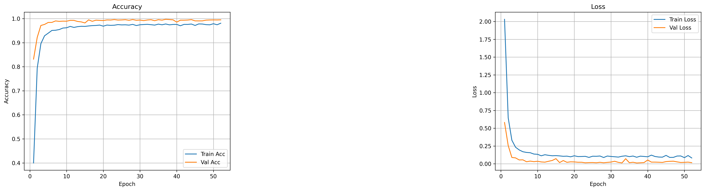
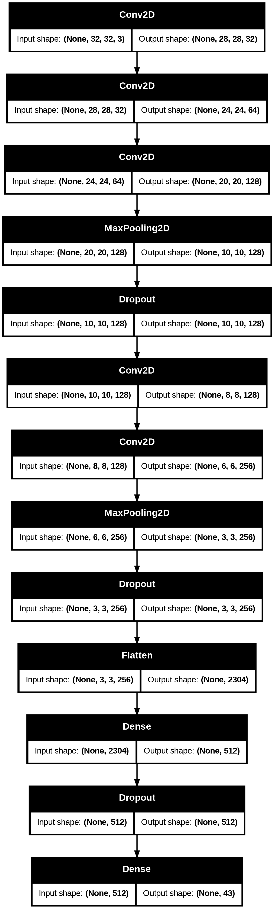

# German Traffic‑Sign Classifier



A Keras‑based multi‑class classifier for the [German Traffic Sign Recognition Benchmark (GTSRB)](http://benchmark.ini.rub.de/?section=gtsrb&subsection=news), achieving:

- **99 %** validation accuracy  
- **97 %** test accuracy  

Try it live via a lightweight [Gradio](https://gradio.app) interface.

---

## 📁 Repository Structure

```
german-traffic-sign-classifier/
├── .gitignore
├── README.md
├── requirements.txt
├── model.h5
├── class_mapping.txt
├── training_metrics.png
├── architecture.png       ← optional model diagram
├── notebook.ipynb
├── app.py
└── check_msvc.py         ← VC++ runtime checker
```

- **model.h5** – pre‑trained Keras model  
- **class_mapping.txt** – `class_id: sign_name` for all 43 classes  
- **training_metrics.png** – accuracy & loss curves  
- **architecture.png** – _(optional)_ network structure  
- **notebook.ipynb** – EDA & training  
- **app.py** – Gradio demo  
- **check_msvc.py** – verifies required MSVC runtimes

---

## 🚀 Quick Setup

1. **Clone the repo**  
   ```bash
   git clone https://github.com/Asembris/german-traffic-sign-classifier.git
   cd german-traffic-sign-classifier
   ```

2. **Create & activate a Python 3.10 venv**

   - **Windows PowerShell**  
     ```powershell
     py -3.10 -m venv venv
     .\venv\Scripts\Activate.ps1
     ```

   - **macOS/Linux**  
     ```bash
     python3.10 -m venv venv
     source venv/bin/activate
     ```

3. **Install dependencies**  
   ```bash
   pip install --upgrade pip
   pip install -r requirements.txt
   ```

4. **Verify MSVC runtime** (Windows only)  
   ```bash
   python check_msvc.py
   ```  
   All three DLLs must load OK.

5. **Launch the Gradio app**  
   ```bash
   python app.py
   ```  
   - **Local URL:** http://127.0.0.1:7860  
   - **Public share link** (automatically generated)

---

## 📈 Performance

| Dataset      | Accuracy |
| ------------ | -------- |
| Validation   | **99 %** |
| Test         | **97 %** |

*Rapid convergence and minimal over‑/under‑fitting.*  

---

## 🏗️ Model Architecture

Generate and include a diagram with:

```python
from tensorflow.keras.utils import plot_model
import tensorflow as tf

model = tf.keras.models.load_model("model.h5", compile=False)
plot_model(model, to_file="architecture.png", show_shapes=True)
```

Embed in this README:

```markdown

```

---

## 📦 Requirements

```text
tensorflow>=2.12.0
gradio>=3.0
numpy
Pillow
```

---

## ✍️ Contributing

1. Fork this repository  
2. Create a feature branch (`git checkout -b feature/...`)  
3. Commit your changes  
4. Submit a pull request  

---

## 📜 License

MIT © Asembris (https://github.com/Asembris)
